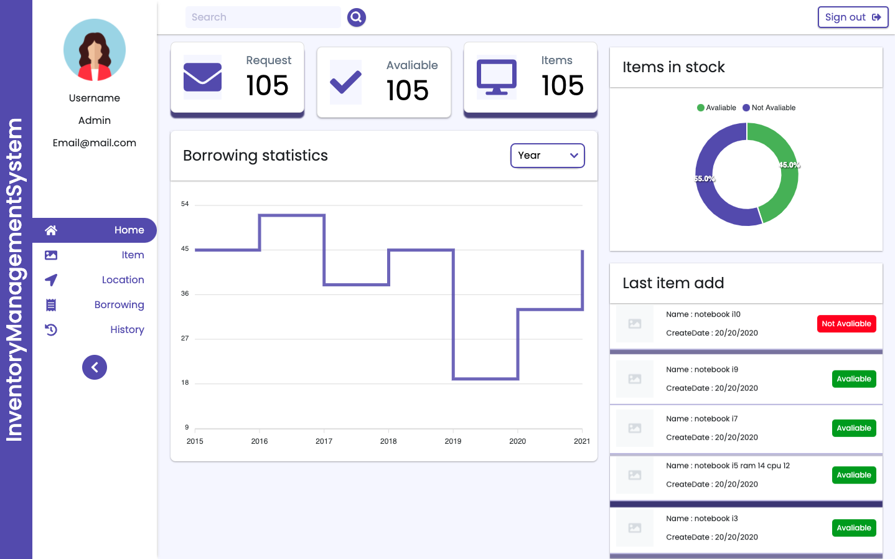
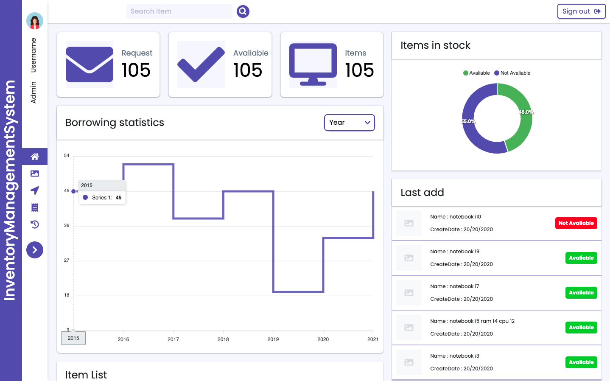

# InventoryManagementSystem

InventoryManagementSystem with django &amp; nextjs

## Preview

<div style='display:flex;flex-direction:row;width:100%;' >


</div>





## Installation

Download and install [Node.Js](https://nodejs.org/en/download/) for install package.
<br/>

Install Python3

```bash
$ npm install python
```

Install pip

```bash
$ npm install pip
```

Create venv python3 with command

```bash
$ python3 -m venv ./venv
```

Activate venv

```bash
$ source venv/bin/activate
```

### Setup Backend Server
go to backend and migrate database
```bash
$ cd backend
$ python manage.py migrate
```

install requirement
```bash
$ pip install -r requirements.txt
```

createsuperuser
```bash
$ python manage.py createsuperuser
```

runserver 
```bash
$ python manage.py runserver
```

create you application http://localhost:8000/o/applications/

Client type : confidential
Authorization Grant Type : password
Redirect Urls : http://localhost:8000

go to InventoryManagementSystem/frontend/pages/api/index.js to set you clientId and clientSecret
```javascript
export const clientId = 'your clientid';
export const clientSecret = 'your clientsecret';
```


### Setup Frontend Server
go to frontend directory
```bash
$ cd frontend
```

install dependencies
```bash
$ npm install
```

start server http://localhost:3000/
```bash
$ npm run dev
```
